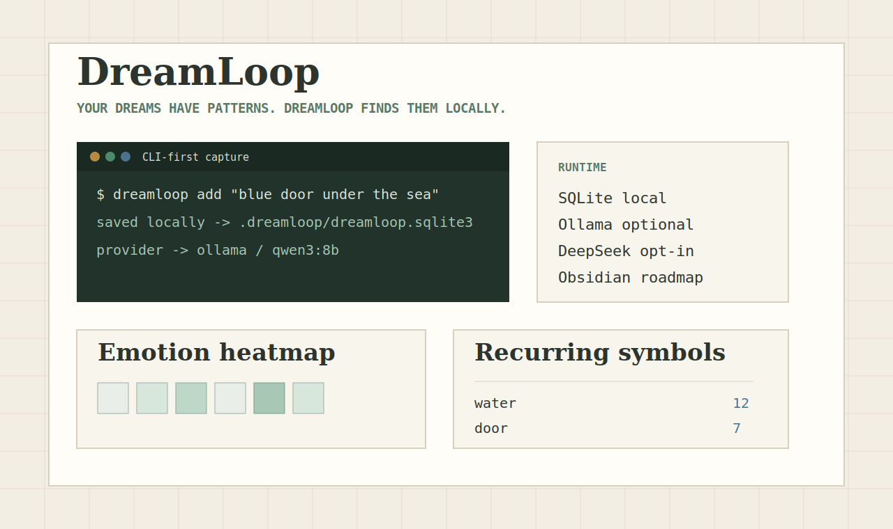

# DreamLoop



**Your dreams have patterns. DreamLoop finds them locally.**

- Runs fully local. Your data never leaves your machine.
- Free with Ollama. Optional DeepSeek/OpenAI if you want cloud models.
- CLI-first, forkable, and built for Obsidian-minded knowledge workers.

```bash
pipx install dreamloop
dreamloop init
dreamloop add "I found a blue door under the sea."
```

DreamLoop is a local-first dream journal for people who want fast capture, private storage, and pattern discovery without renting their inner life to another subscription app.

## Why This Project

Commercial dream apps usually make you pay for analysis and push personal text into a cloud workflow. DreamLoop takes the opposite path: the journal is local, the CLI is the primary interface, and AI is a swappable layer.

The default path is zero-cost Ollama. DeepSeek and OpenAI are optional cloud providers for people who want stronger hosted models. The code is small enough to fork and direct enough to extend.

## Quick Start

```bash
pipx install dreamloop
dreamloop init
dreamloop add "I was flying above a dark ocean." --tag water --mood anxious
```

Then open the local dashboard:

```bash
dreamloop web
```

The dashboard starts at `http://127.0.0.1:8765`.

## CLI Demo

```text
$ dreamloop add "A door opened under the sea." --tag water --tag threshold
saved locally -> .dreamloop/dreamloop.sqlite3
analysis -> pending

$ dreamloop ai use ollama --model qwen3:8b
AI provider set to ollama (qwen3:8b).

$ dreamloop analyze --pending
Analyzed pending dreams when a provider is ready.
```

Future release assets will include `docs/assets/cli-demo.cast` and `docs/assets/cli-demo.gif`.

## Privacy Promise

- Dream entries are stored in `.dreamloop/dreamloop.sqlite3`.
- `.dreamloop/` is automatically ignored by Git.
- Your dreams are never uploaded by default.
- Ollama keeps analysis local on your machine.
- DeepSeek/OpenAI only run after explicit configuration.
- API keys live in `.dreamloop/secrets.env`; secrets do not belong in commits.

## AI Providers

DreamLoop supports provider configuration without changing the journal model:

```bash
dreamloop ai status
dreamloop ai use ollama --model qwen3:8b
dreamloop ai use deepseek --model deepseek-v4-flash
dreamloop ai test
```

Provider defaults:

- `ollama`: local, `http://localhost:11434/v1`, model `qwen3:8b`
- `deepseek`: cloud, `https://api.deepseek.com`, model `deepseek-v4-flash`
- `openai`: cloud, OpenAI-compatible JSON analysis
- `none`: capture-only local journal mode

## Web Dashboard

The FastAPI/Jinja dashboard is intentionally lightweight:

- CLI-first capture preview
- local runtime status
- model/provider status
- privacy contract
- emotion heatmap
- recurring symbol trends
- recent dream log
- detail pages with structured analysis and raw JSON

The same app exposes JSON endpoints:

- `POST /api/dreams`
- `GET /api/dreams`
- `GET /api/dreams/{id}`
- `GET /api/dreams/{id}/similar`
- `POST /api/analyze/pending`
- `POST /api/import/ics`
- `POST /api/weather/sync`
- `GET /api/insights/heatmap`
- `GET /api/insights/trends`

## Local Data Model

```text
.dreamloop/
  dreamloop.sqlite3
  config.json
  secrets.env
  chroma/
  exports/
  imports/
```

SQLite stores dreams, analysis results, imported calendar events, and synced weather. ChromaDB remains optional for richer vector search.

## Obsidian Roadmap

- v0.2: Markdown export for dream entries and analysis summaries.
- v0.3: Obsidian vault sync with stable frontmatter.
- v0.4: Community plugin for capture, backlinks, and local dashboard launch.

## Roadmap

### v0.1

- Local CLI and Web dashboard.
- SQLite storage.
- Ollama-first provider settings.
- Optional DeepSeek/OpenAI structured analysis.
- Heatmap, `.ics` import, weather sync.
- Similar dreams and basic trends.

### v0.2

- Markdown export.
- Better screenshots and CLI GIF assets.
- ChromaDB-backed clustering and recurring-theme insights.
- Backup and restore flows.

### v0.3+

- Obsidian vault sync.
- Obsidian community plugin.
- Generated dream illustrations stored locally as opt-in artifacts.

## Contributing

DreamLoop is deliberately small and forkable. Good first contributions:

- improve local model prompts
- add `.ics` fixtures
- polish dashboard accessibility
- expand Markdown/Obsidian export
- add terminal demo assets

Run tests with:

```bash
uv run --extra dev pytest
```

Build the package with:

```bash
uv build
```

## License

MIT
