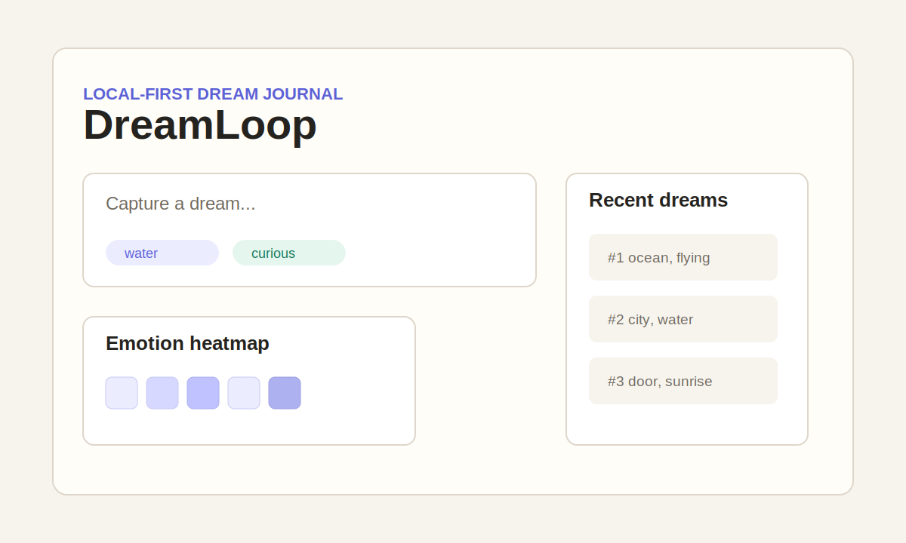

# DreamLoop

DreamLoop is a local-first dream journal for people who want to capture dreams quickly and notice patterns over time.

Dreams stay on your machine first. AI analysis, weather context, calendar imports, and future image generation are optional layers you choose to enable.

DreamLoop 是一个本地优先的 AI 梦境日志。它先帮你在醒来后的几秒钟里把梦记下来，再慢慢整理情绪、符号、主题、天气和日历线索。

```bash
uvx dreamloop init
uvx dreamloop add "I was flying above a dark ocean." --tag water --tag flying --mood anxious
uvx dreamloop web
```



## Why DreamLoop

Most dream journals are either too slow when you wake up or too private to trust to a cloud app. DreamLoop is built around a smaller promise: record first, locally; analyze later, only when you opt in.

很多梦境记录工具的问题是：醒来时太慢，长期回看又太散。DreamLoop 的第一原则是本地优先，默认数据保存在当前目录的 `.dreamloop/`，并自动加入 `.gitignore`，避免把私人梦境误提交。

## Features

- Fast CLI capture with `dreamloop add`.
- Local SQLite database in `.dreamloop/dreamloop.sqlite3`.
- FastAPI + Jinja local dashboard.
- Structured AI analysis when `OPENAI_API_KEY` is configured.
- Pending analysis queue so capture never waits for an LLM call.
- Emotion heatmap for daily review.
- Local `.ics` calendar import.
- Open-Meteo weather sync with no API key.
- Similar dream lookup and basic tag/symbol/theme trends.
- Future-ready roadmap for ChromaDB and generated dream illustrations.

## Quick Start

Install with `pipx` or run directly with `uvx`:

```bash
pipx install dreamloop
dreamloop init
dreamloop add "A door opened under the sea." --tag water --mood curious
dreamloop web
```

For local development from this repository:

```bash
uv sync --extra dev
uv run dreamloop init
uv run dreamloop add "I walked through a city made of glass." --tag city
uv run dreamloop web
```

The dashboard starts on `http://127.0.0.1:8765` by default.

## Local-first Data Model

DreamLoop creates a private project-local data directory:

```text
.dreamloop/
  dreamloop.sqlite3
  chroma/
  exports/
  imports/
```

SQLite stores dreams, structured analyses, imported calendar events, and synced weather. ChromaDB is optional and reserved for richer vector search; core logging and browsing work without it.

## AI Setup

DreamLoop works without an API key. In that mode it is a fast local journal with Web browsing, heatmaps, ICS import, weather sync, and pattern tracking.

To enable structured AI analysis:

```bash
set OPENAI_API_KEY=sk-...
dreamloop analyze --pending
```

Each analysis stores fixed queryable fields plus the raw JSON response:

- emotional tone
- archetypal symbols
- narrative themes
- summary
- confidence

## CLI Reference

```bash
dreamloop init
dreamloop add "I was flying above a dark ocean." --tag water --tag flying --mood anxious
dreamloop list
dreamloop show 1
dreamloop analyze --pending
dreamloop import ics calendar.ics
dreamloop weather sync --lat 31.2304 --lon 121.4737
dreamloop export
dreamloop web
```

## Web Dashboard

The local Web UI includes:

- dream capture form
- recent dream list
- dream detail pages
- AI analysis display
- emotion heatmap
- imported calendar context
- synced weather context

The same FastAPI app also exposes JSON endpoints for integrations:

- `POST /api/dreams`
- `GET /api/dreams`
- `GET /api/dreams/{id}`
- `GET /api/dreams/{id}/similar`
- `POST /api/analyze/pending`
- `POST /api/import/ics`
- `POST /api/weather/sync`
- `GET /api/insights/heatmap`
- `GET /api/insights/trends`

## Weather and Calendar

Weather sync uses Open-Meteo and does not require an API key. Calendar support intentionally starts with local `.ics` import instead of Google or Apple OAuth, keeping the v0.1 privacy story simple.

```bash
dreamloop import ics my-calendar.ics
dreamloop weather sync --lat 31.2304 --lon 121.4737
```

## Roadmap

### v0.1

- Local CLI and Web dashboard.
- SQLite storage.
- Optional OpenAI structured analysis.
- Heatmap, `.ics` import, weather sync.
- Similar dreams and basic trends.

### v0.2

- Beta-level UI polish.
- ChromaDB-backed clustering and recurring-theme insights.
- Stronger backup and restore flows.
- Better import/export formats.
- Generated dream illustrations stored locally as opt-in artifacts.

## Contributing

DreamLoop is designed as a small, readable Python project. Good first contributions include:

- adding fixtures for more `.ics` variants
- improving dashboard accessibility
- expanding local pattern tracking
- adding export formats
- improving README screenshots

Run tests with:

```bash
uv run --extra dev pytest
```

## License

MIT
