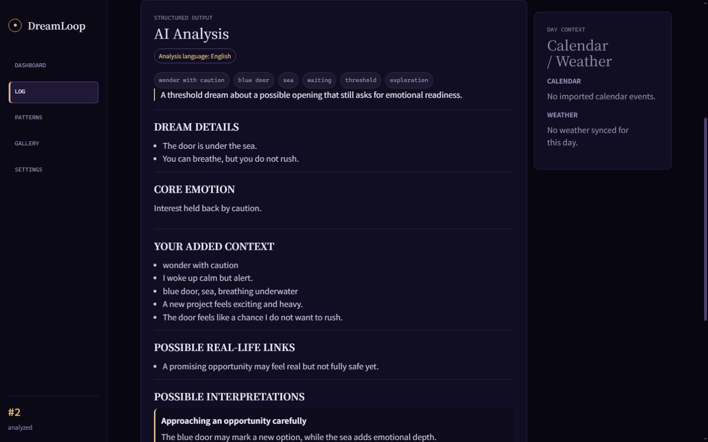
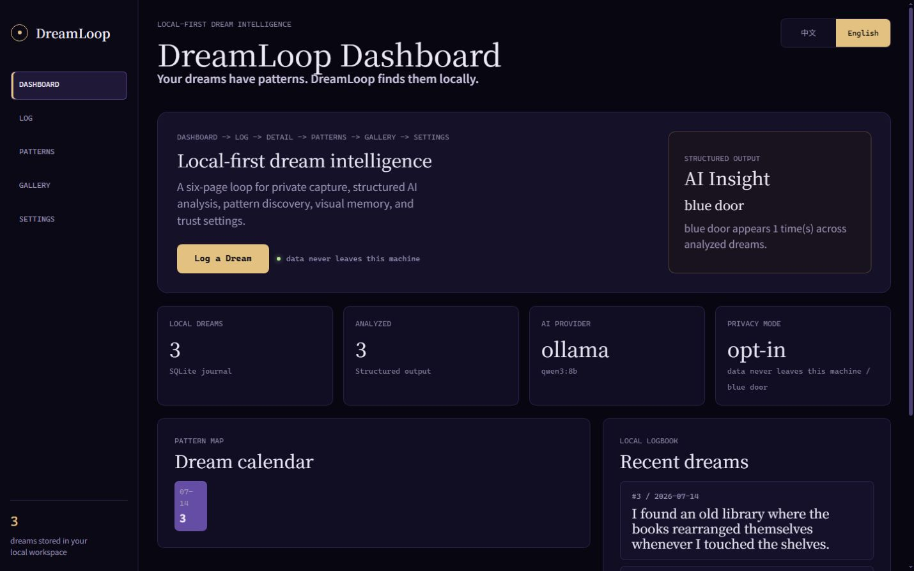
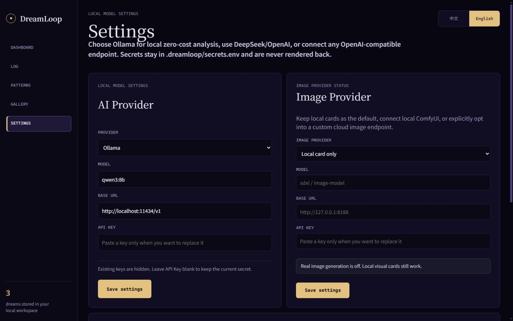
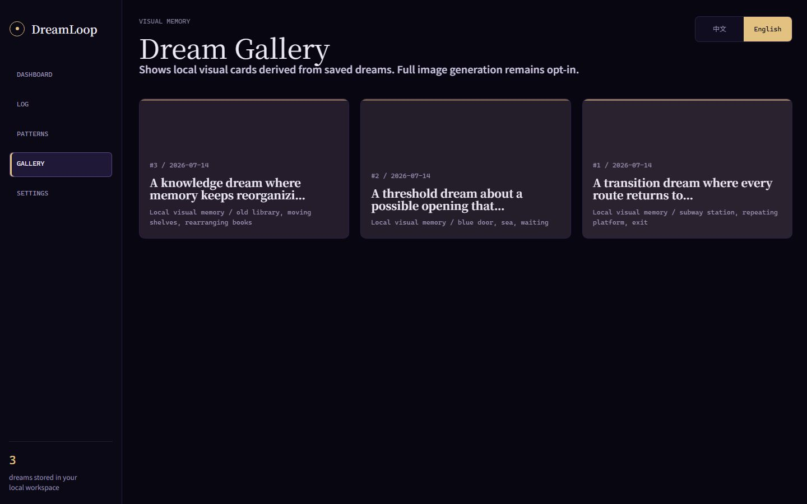

# DreamLoop

[English](README.md) | [中文](README.zh-CN.md)

[](https://github.com/saime428/DreamLoop/actions/workflows/ci.yml)
[](https://pypi.org/project/dreamloop/)
[](https://pypi.org/project/dreamloop/)



> "The repeating platform may reflect revisiting the same choice from different angles. Which real choice keeps bringing you back to the same concern?"



**Your dreams have patterns. DreamLoop finds them locally.**

- Runs fully local. Your data never leaves your machine.
- Free with Ollama. Optional DeepSeek/OpenAI or custom OpenAI-compatible endpoints.
- CLI-first, forkable, and built for Obsidian-minded knowledge workers.
- English and Chinese analysis is language-checked before saving; switching the UI preserves unsaved analyzed drafts without relabeling results.
- Full CJK fonts and responsive layouts are bundled locally with no remote font requests.
- PyPI and source checkout keep data in `.dreamloop/`; Docker uses a named volume by default.

```bash
pipx install dreamloop
dreamloop init
dreamloop demo
dreamloop web
```

```bash
git clone https://github.com/saime428/DreamLoop.git
cd DreamLoop
uv sync --extra dev
uv run dreamloop init
uv run dreamloop demo
uv run dreamloop web
```

## What You Get

### Private local journal

Dream entries, settings, secrets, generated images, and exports live under `.dreamloop/`. Nothing uploads by default.

<p align="center">
  
</p>

### AI interpretation

DreamLoop can use Ollama locally or an explicit cloud/custom OpenAI-compatible provider to produce structured analysis: emotions, symbols, themes, multiple interpretations, and reality-check questions. Output language is validated before analysis is stored.

### Visual memory

Every saved dream can create a local visual-memory card without any image API. Real image generation is opt-in.

<p align="center">
  
</p>


## Quick Start

### Five-minute PyPI demo

```bash
pipx install dreamloop
dreamloop init
dreamloop demo
dreamloop web
```

Open `http://127.0.0.1:8765`. The demo seeds local sample dreams, mock analyses, and visual memory cards. No cloud AI is required.

### Docker demo

```bash
docker compose up
```

Open `http://localhost:8765`. Demo data is only added when the local store is empty. Docker Compose stores `.dreamloop/` in the `dreamloop-data` named volume; switch the volume to `./.dreamloop:/app/.dreamloop` if you want host-visible files.

### Markdown / Obsidian export

```bash
dreamloop export --format markdown
```

DreamLoop writes one Markdown file per dream plus an `_index.md` wikilink index under `.dreamloop/exports/`.

<details>
<summary>Advanced Setup</summary>

### Run from source

```bash
git clone https://github.com/saime428/DreamLoop.git
cd DreamLoop
uv sync --extra dev
uv run dreamloop init
uv run dreamloop add "I found a blue door under the sea."
uv run dreamloop web
```

### Enable local Ollama analysis

```bash
ollama pull qwen3:8b
uv run dreamloop ai use ollama --model qwen3:8b
uv run dreamloop ai test
uv run dreamloop analyze --pending
```

### Configure providers

```bash
uv run dreamloop ai status
uv run dreamloop ai use ollama --model qwen3:8b
uv run dreamloop ai use deepseek --model deepseek-v4-flash
uv run dreamloop ai use custom --model local-model --base-url http://localhost:1234/v1
uv run dreamloop image use local_card
uv run dreamloop image use cloud_openai_compatible --model image-model --base-url https://images.example/v1
```

If port `8765` is blocked on Windows:

```bash
dreamloop web --port 18080
```

</details>

## Why This Project

Commercial dream apps often make you pay for analysis and push intimate text into a cloud workflow. DreamLoop takes the opposite path: the journal is local, the CLI is primary, and AI is a swappable layer.

The default path is zero-cost Ollama. DeepSeek, OpenAI, and custom OpenAI-compatible endpoints are optional for people who want stronger hosted models or their own local gateway.

## Web App Loop

Dashboard -> Log -> Detail -> Patterns -> Gallery -> Settings.

- Dashboard: AI Insight, heatmap, stats, and recent dreams.
- Log: draft-first capture with optional reflection prompts; language switching preserves unsaved content and analyzed results.
- Detail: original dream text, truthful analysis-language labels, explicit regeneration, feedback, local cards, and opt-in images.
- Patterns: calendar, recurring symbols, themes, resonant feedback, and a symbol network.
- Gallery: real generated images when configured, otherwise local visual cards.
- Settings: AI provider, image provider, launch notes, data directory, and privacy status.

The same FastAPI app exposes JSON endpoints for dreams, feedback, images, heatmap, trends, and symbol graph data.

## Privacy Promise

- Dream entries are stored in `.dreamloop/dreamloop.sqlite3`.
- `.dreamloop/` is ignored by Git.
- Your dreams are never uploaded by default.
- Ollama keeps analysis local on your machine.
- DeepSeek/OpenAI/custom providers only run after explicit configuration.
- API keys live in `.dreamloop/secrets.env`; secrets do not belong in commits.

## Local Data Model

```text
.dreamloop/
  dreamloop.sqlite3
  config.json
  secrets.env
  assets/images/
  exports/
  imports/
```

## Status

### Available now

DreamLoop v0.2 adds:

- Docker demo with `docker compose up`.
- Markdown / Obsidian export via `dreamloop export --format markdown`.
- Symbol co-occurrence graph on Patterns for shareable screenshots.
- Chinese demo data via `dreamloop demo --language zh`.
- GHCR image publishing on GitHub releases.
- Stateless English/Chinese interface switching that preserves unsaved analyzed drafts.
- Analysis-language validation and explicit mismatch handling before persistence.
- Full offline Noto Sans SC and Noto Serif SC coverage with a fixed responsive type scale.

The source-based Docker demo builds locally today. Release images publish as `ghcr.io/saime428/dreamloop` when a GitHub release is published.

Current source verification: 156 automated tests pass. Browser QA covers all six pages in both languages across five desktop, tablet, and mobile viewports.

### Next

- Obsidian vault sync.
- Obsidian community plugin.
- Lightweight local clustering without a required vector database.
- Backup and restore flows.

## Contributing

DreamLoop is deliberately small and forkable. See [CONTRIBUTING.md](CONTRIBUTING.md).

Run tests with:

```bash
uv run --extra dev pytest
```

Build the package with:

```bash
uv build
```

## License

MIT
