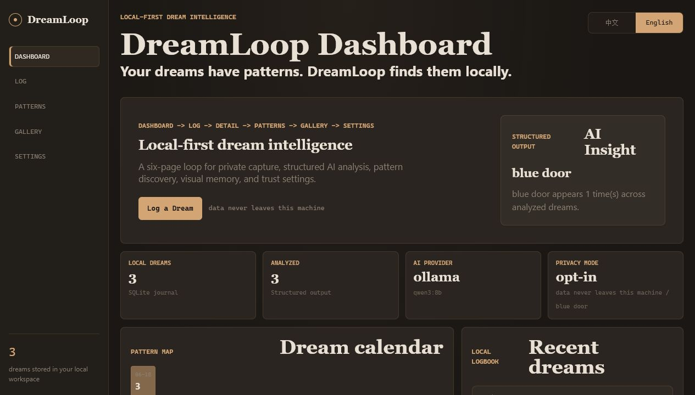
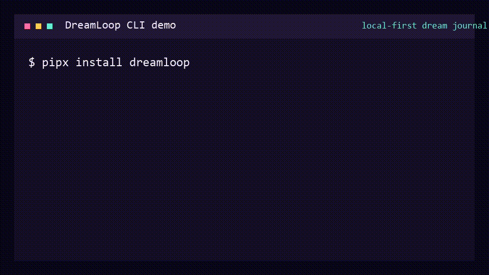
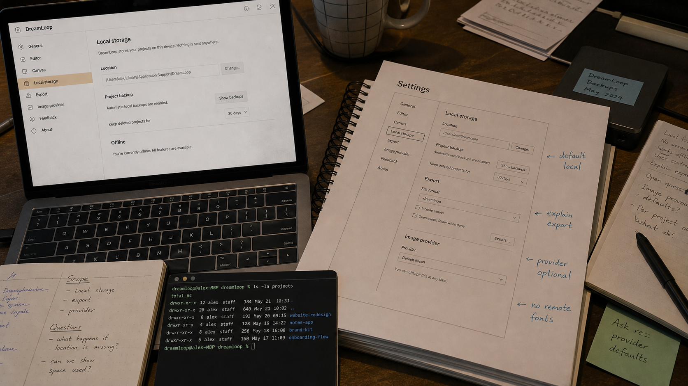
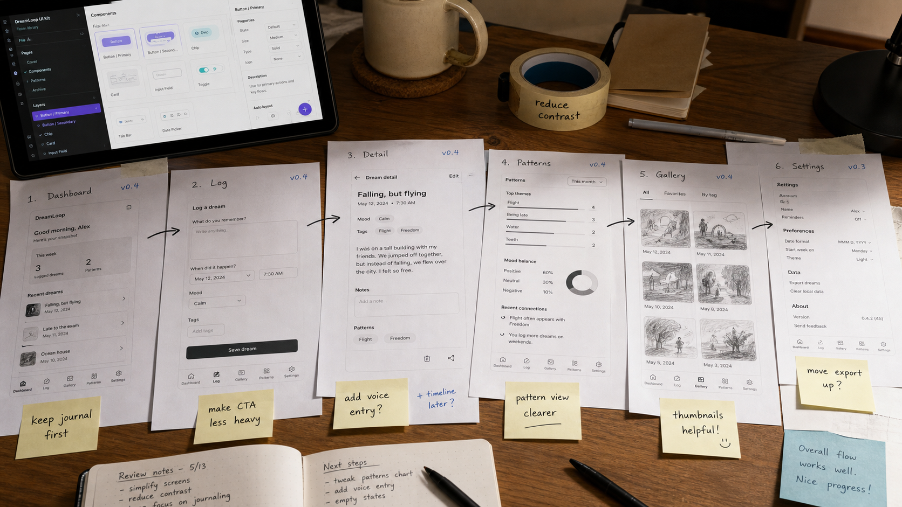

# DreamLoop

[English](README.md) | [中文](README.zh-CN.md)

[](https://github.com/saime428/DreamLoop/actions/workflows/ci.yml)
[](https://pypi.org/project/dreamloop/)
[](https://pypi.org/project/dreamloop/)





**Your dreams have patterns. DreamLoop finds them locally.**

- Runs fully local. Your data never leaves your machine.
- Free with Ollama. Optional DeepSeek/OpenAI or custom OpenAI-compatible endpoints.
- CLI-first, forkable, and built for Obsidian-minded knowledge workers.
- Detailed dream analysis that favors emotions, real-life context, and multiple verifiable interpretations.
- Optional dream images are explicit opt-in: local cards by default, OpenAI-compatible cloud endpoints only when configured, and local ComfyUI reserved for workflow-backed generation.

```bash
git clone https://github.com/saime428/DreamLoop.git
cd DreamLoop
uv sync --extra dev
uv run dreamloop init
uv run dreamloop web
```

DreamLoop is a local-first dream journal for people who want fast capture, private storage, and pattern discovery without renting their inner life to another subscription app. The web app follows a six-page loop: Dashboard -> Log -> Detail -> Patterns -> Gallery -> Settings.

## Quick Start

### Five-minute PyPI demo

```bash
pipx install dreamloop
dreamloop init
dreamloop demo
dreamloop web
```

Expected result:

```text
DreamLoop seeds three local sample dreams, mock analyses, and visual memory cards.
The dashboard opens at http://127.0.0.1:8765 with Dashboard, Patterns, and Gallery populated.
No cloud AI is required for this demo.
```

### Run locally without AI

```bash
git clone https://github.com/saime428/DreamLoop.git
cd DreamLoop
uv sync --extra dev
uv run dreamloop init
uv run dreamloop add "I found a blue door under the sea."
uv run dreamloop web
```

Expected result:

```text
DreamLoop stores the entry in .dreamloop/dreamloop.sqlite3.
The local dashboard starts at http://127.0.0.1:8765.
AI analysis stays pending until you configure a provider.
```

You can also run `uv run dreamloop doctor` to check the data directory, SQLite, provider settings, Ollama connectivity, and hidden key status without printing secrets.

### Enable local Ollama analysis

```bash
ollama pull qwen3:8b
uv run dreamloop ai use ollama --model qwen3:8b
uv run dreamloop ai test
uv run dreamloop analyze --pending
```

Expected result:

```text
Ollama is used through http://localhost:11434/v1.
DreamLoop writes structured analysis back to local SQLite.
```

## Why This Project

Commercial dream apps usually make you pay for analysis and push personal text into a cloud workflow. DreamLoop takes the opposite path: the journal is local, the CLI is the primary interface, and AI is a swappable layer.

The default path is zero-cost Ollama. DeepSeek, OpenAI, and custom OpenAI-compatible endpoints are optional for people who want stronger hosted models or their own local gateway. The code is small enough to fork and direct enough to extend.

## Demo Assets

- Real dashboard screenshot: `docs/assets/dashboard-screenshot.png`
- Product workflow review image: `docs/assets/readme-workflow-review.png`
- Local-first privacy review image: `docs/assets/readme-local-first-privacy.png`
- Social preview image: `docs/assets/social-preview.png`
- CLI demo GIF: `docs/assets/cli-demo.gif`
- Reproducible recording guide: `docs/demo-recording.md`

The recording guide covers CLI capture, the Dashboard -> Log -> Detail flow, Patterns filtering, Gallery, and Settings without exposing secrets.

## CLI Demo

```text
$ uv run dreamloop add "A door opened under the sea."
saved locally -> .dreamloop/dreamloop.sqlite3
analysis -> pending

$ uv run dreamloop ai use ollama --model qwen3:8b
AI provider set to ollama (qwen3:8b).

$ uv run dreamloop analyze --pending
Analyzed pending dreams when a provider is ready.
```

## Privacy Promise

- Dream entries are stored in `.dreamloop/dreamloop.sqlite3`.
- `.dreamloop/` is automatically ignored by Git.
- Your dreams are never uploaded by default.
- Ollama keeps analysis local on your machine.
- DeepSeek/OpenAI only run after explicit configuration.
- API keys live in `.dreamloop/secrets.env`; secrets do not belong in commits.

<p align="center">
  
</p>

## AI Providers

DreamLoop supports provider configuration without changing the journal model:

```bash
uv run dreamloop ai status
uv run dreamloop ai use ollama --model qwen3:8b
uv run dreamloop ai use deepseek --model deepseek-v4-flash
uv run dreamloop ai use custom --model local-model --base-url http://localhost:1234/v1
uv run dreamloop ai test
```

Provider defaults:

- `ollama`: local, `http://localhost:11434/v1`, model `qwen3:8b`
- `deepseek`: cloud, `https://api.deepseek.com`, model `deepseek-v4-flash`
- `openai`: cloud, OpenAI-compatible JSON analysis
- `custom`: any OpenAI-compatible `/v1` endpoint, including local gateways
- `none`: capture-only local journal mode

## Image Providers

DreamLoop does not call an image API by default. Detail pages always support a local visual-memory card, and real image generation is opt-in. In v0.1.2 the cloud OpenAI-compatible path can generate files; the local ComfyUI option is a configuration and connectivity checkpoint until a workflow is attached.

```bash
dreamloop image use local_card
dreamloop image use local_comfyui --base-url http://127.0.0.1:8188
dreamloop image use cloud_openai_compatible --model image-model --base-url https://images.example/v1
dreamloop image test
```

Generated image files are stored under `.dreamloop/assets/images/`; the database stores local metadata such as provider, model, prompt, path, status, and error. ComfyUI readiness can be checked with `dreamloop image test`, but prompt submission stays disabled until a workflow is configured.

## Web App Loop

The FastAPI/Jinja dashboard is intentionally lightweight:

<p align="center">
  
</p>

- Dashboard: README-ready overview with AI Insight, heatmap, stats, and recent dreams
- Log: draft-first dream capture, optional reflection prompts, and AI analysis before saving
- Detail: original dream text, detailed interpretation, reality-grounded questions, raw JSON, and an opt-in visual-memory entry point
- Patterns: clickable calendar, recurring symbols, theme trends, and filters back into Log
- Gallery: real generated images when configured, otherwise local visual cards derived from saved dreams
- Settings: AI provider, image provider, launch notes, local data directory, and privacy status

DreamLoop is currently launched with `uv run dreamloop web` from a checkout or `dreamloop web` after package install. A native desktop app is a later packaging task; v0.1 stays lightweight so the local-first core remains easy to inspect and fork.

The same app exposes JSON endpoints:

- `POST /api/dreams`
- `GET /api/dreams`
- `GET /api/dreams/{id}`
- `GET /api/dreams/{id}/similar`
- `POST /api/analyze/pending`
- `POST /api/dreams/{id}/feedback`
- `POST /api/dreams/{id}/image`
- `GET /api/feedback/summary`
- `GET /api/images/status`
- `POST /api/import/ics`
- `POST /api/weather/sync`
- `GET /api/insights/heatmap`
- `GET /api/insights/trends`

## Local Data Model

```text
.dreamloop/
  dreamloop.sqlite3
  config.json
  secrets.env
  assets/images/
  chroma/
  exports/
  imports/
```

SQLite stores dreams, analysis results, imported calendar events, and synced weather. ChromaDB remains optional for richer vector search.

## PyPI Install

Install the published package with:

```bash
pipx install dreamloop
dreamloop init
dreamloop doctor
dreamloop demo
dreamloop add "I was flying above a dark ocean."
dreamloop web
```

### Port already bound on Windows

DreamLoop starts on `127.0.0.1:8765` by default. If Windows reports a socket permission error or the port is already bound, run:

```bash
dreamloop web --port 18080
```

Then open `http://127.0.0.1:18080`. You can inspect the default port in PowerShell:

```powershell
Get-NetTCPConnection -LocalPort 8765 -ErrorAction SilentlyContinue
```

## Obsidian Roadmap

- v0.2: Markdown export for dream entries and analysis summaries.
- v0.3: Obsidian vault sync with stable frontmatter.
- v0.4: Community plugin for capture, backlinks, and local dashboard launch.

## Roadmap

### v0.1

- Local CLI and six-page Web loop.
- SQLite storage.
- Ollama-first provider settings.
- Optional DeepSeek/OpenAI/custom structured analysis.
- Optional reflection prompts and longer reality-grounded interpretation reports.
- Heatmap, `.ics` import, weather sync.
- Similar dreams and basic trends.
- Real screenshot assets, CI, changelog, and public release packaging.

### v0.1.1

- Dashboard hero overflow fix for English and Chinese layouts.
- `dreamloop doctor` for local setup checks without revealing secrets.
- `dreamloop demo` for a fast no-AI walkthrough with sample dreams and local visual cards.
- Local feedback buttons on interpretations: resonates, not accurate, unsure.
- Patterns summary for high-resonance themes.

### v0.1.2

- Dashboard first-screen polish for screenshot quality.
- Subtle page transitions with reduced-motion support.
- Optional image provider settings for local visual cards, ComfyUI readiness checks, and custom cloud image endpoints.
- Real generated image storage in `.dreamloop/assets/images/`.
- Gallery prefers real dream images and falls back to local visual cards.

### v0.2

- Markdown export.
- CLI GIF/cast release assets.
- ChromaDB-backed clustering and recurring-theme insights.
- Backup and restore flows.

### v0.3+

- Obsidian vault sync.
- Obsidian community plugin.
- Generated dream illustrations stored locally as opt-in artifacts.

## Contributing

DreamLoop is deliberately small and forkable. Good first contributions:

- improve local model prompts
- add `.ics` fixtures
- polish dashboard accessibility
- expand Markdown/Obsidian export
- improve terminal demo recording automation

Run tests with:

```bash
uv run --extra dev pytest
```

Build the package with:

```bash
uv build
```

## License

MIT
