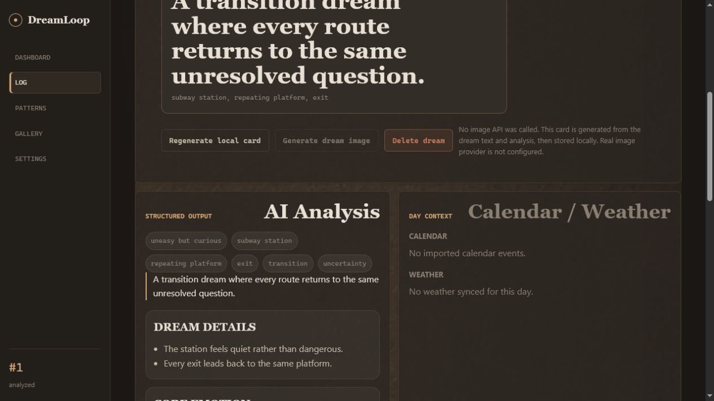

# DreamLoop

[English](README.md) | [中文](README.zh-CN.md)

[](https://github.com/saime428/DreamLoop/actions/workflows/ci.yml)
[](https://pypi.org/project/dreamloop/)
[](https://pypi.org/project/dreamloop/)



> “空站台可能反映一种没有控制权的等待。最近哪个等待让你既期待又无法安排下一步？”


**梦会重复说话，DreamLoop 帮你在本地听见。**

- 本地优先。梦境数据默认不离开你的机器。
- Ollama 零成本运行；需要云模型时再显式配置 DeepSeek、OpenAI 或 Custom OpenAI-compatible。
- CLI-first，容易 fork，适合开发者和 Obsidian 式知识工作流。
- AI 解读会关注情绪、现实处境、多种可验证解释，而不是只给玄学摘要。
- Docker 默认使用 named volume；PyPI 和源码运行会把数据放在 `.dreamloop/`。

```bash
pipx install dreamloop
dreamloop init
dreamloop demo
dreamloop web
```

```bash
git clone https://github.com/saime428/DreamLoop.git
cd DreamLoop
uv sync --extra dev
uv run dreamloop init
uv run dreamloop demo
uv run dreamloop web
```

## 你能得到什么

### 私密日记

梦境、设置、密钥、生成图片和导出文件都在 `.dreamloop/`。默认不上传。

<p align="center">
  
</p>

### AI 解读

DreamLoop 可以用本地 Ollama，或你显式配置的云端/自定义 OpenAI-compatible provider，生成情绪、符号、主题、多种解释和现实验证问题。

### 视觉记忆

每条梦境都能生成本地视觉记忆卡片，不调用图片 API。真实图片生成是可选功能。

<p align="center">
  
</p>


## 快速开始

### 5 分钟 PyPI demo

```bash
pipx install dreamloop
dreamloop init
dreamloop demo
dreamloop web
```

打开 `http://127.0.0.1:8765`。demo 会写入本地示例梦境、mock 分析和视觉记忆卡片，不需要云 AI。

### Docker demo

```bash
docker compose up
```

打开 `http://localhost:8765`。只有本地库为空时才会写入 demo 数据。Docker Compose 默认把 `.dreamloop/` 放在 `dreamloop-data` named volume；如果想在宿主机直接看到文件，把 volume 改成 `./.dreamloop:/app/.dreamloop`。

### Markdown / Obsidian 导出

```bash
dreamloop export --format markdown
```

DreamLoop 会在 `.dreamloop/exports/` 下写入每条梦境的 Markdown 文件和一个 `_index.md` wikilink 索引。

<details>
<summary>高级设置</summary>

### 从源码运行

```bash
git clone https://github.com/saime428/DreamLoop.git
cd DreamLoop
uv sync --extra dev
uv run dreamloop init
uv run dreamloop add "我梦见海底有一扇蓝色的门。"
uv run dreamloop web
```

### 启用本地 Ollama 分析

```bash
ollama pull qwen3:8b
uv run dreamloop ai use ollama --model qwen3:8b
uv run dreamloop ai test
uv run dreamloop analyze --pending
```

### 配置提供方

```bash
uv run dreamloop ai status
uv run dreamloop ai use ollama --model qwen3:8b
uv run dreamloop ai use deepseek --model deepseek-v4-flash
uv run dreamloop ai use custom --model local-model --base-url http://localhost:1234/v1
uv run dreamloop image use local_card
uv run dreamloop image use cloud_openai_compatible --model image-model --base-url https://images.example/v1
```

Windows 如果 `8765` 端口不可用：

```bash
dreamloop web --port 18080
```

</details>

## 为什么做它

很多梦境类 App 把 AI 分析做成订阅，也默认把很私密的文本送进云端。DreamLoop 的方向相反：数据先在本地落地，AI 是可替换层，只有你明确选择后才会使用云模型。

默认推荐路径是 Ollama，本机即可零成本分析。DeepSeek、OpenAI 和 Custom OpenAI-compatible 端点都是可选增强。

## 六页闭环

Dashboard -> Log -> Detail -> Patterns -> Gallery -> Settings。

- Dashboard：AI 洞察、热力图、统计和最近梦境。
- Log：先写梦境，可补充 reflection prompts，再保存。
- Detail：原文、详细解释、反馈、本地卡片和可选图片。
- Patterns：日历、反复出现的符号、主题、反馈共鸣和符号网络图。
- Gallery：优先展示真实生成图像，否则展示本地视觉卡片。
- Settings：AI provider、图片 provider、本地数据目录和隐私状态。

## 隐私承诺

- 梦境文本存储在 `.dreamloop/dreamloop.sqlite3`。
- `.dreamloop/` 会被 Git 忽略。
- 默认不会上传梦境。
- Ollama 路径保持本机分析。
- DeepSeek/OpenAI/Custom 只有显式配置后才会使用。
- API key 写入 `.dreamloop/secrets.env`，不应进入提交。

## 本地数据模型

```text
.dreamloop/
  dreamloop.sqlite3
  config.json
  secrets.env
  assets/images/
  exports/
  imports/
```

## 当前状态

### 当前可用

DreamLoop v0.2 新增：

- `docker compose up` 一键 demo。
- `dreamloop export --format markdown` Markdown / Obsidian 导出。
- Patterns 页符号共现图，适合截图传播。
- `dreamloop demo --language zh` 中文 demo 数据。
- GitHub release 发布时推送 GHCR 镜像。

源码 Docker demo 现在会本地构建。发布 GitHub release 后，会推送 `ghcr.io/saime428/dreamloop` 镜像。

### 下一步

- Obsidian vault 同步。
- Obsidian community plugin。
- 不依赖向量数据库的轻量本地聚类。
- 备份和恢复流程。

## 贡献

DreamLoop 刻意保持小而可 fork。见 [CONTRIBUTING.md](CONTRIBUTING.md)。

运行测试：

```bash
uv run --extra dev pytest
```

构建：

```bash
uv build
```

## License

MIT
